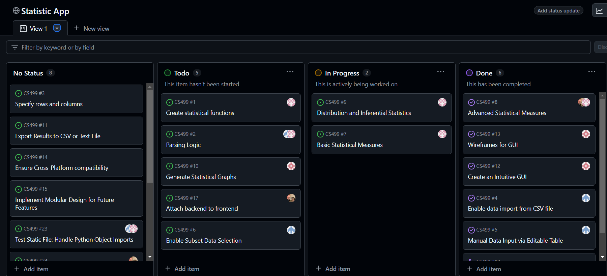
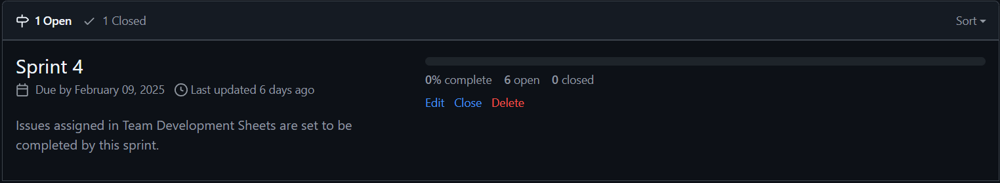

= Backlog/Requirements 
:doctitle: 
:toc:

== Team Members
*Sarah Ibsen* (Team Lead) 
*Natalia Miller* (Admin)
*Jarrett Miller* (Software Developer)
*Matthew Sim* (Software Developer)

== Project Overview 
The Statistical Analyzer [STAT] project aims to develop a flexible and comprehensive software tool designed for researchers, particularly in the social sciences, to perform in-depth statistical analysis on datasets. The system will enable users to input data, select appropriate statistical methods, visualize the results, and generate detailed reports. This tool is intended to streamline the process of statistical analysis by providing a user-friendly graphical interface and support for a variety of statistical measures and formats. The software will also be designed for extensibility to accommodate future statistical functions with minimal effort, ensuring long-term adaptability.

== Tools
For the project, we use epics/stories to help create our issues on Github. 
We set up an Agile-like environment in Github, where we have a 'No Status' (our backlog), 'To Do', 'In Progress', and 'Done' columns. 

.Board

We also have sprints, where we can assign issues that we want to get done in a certain time frame. 

.Sprint

== Requirements
1. The system shall accept input data from either a comma-delimited file or an on-screen editable table.
2. The system shall allow users to select specific statistical measures for analysis.
3. The system shall calculate mean, median, mode, standard deviation, variance, coefficient of variance, percentiles, probability distribution, binomial distribution, least square line, Chi-Square (Χ²), correlation coefficient, sign test, rank sum test, and Spearman rank correlation coefficient.
4. The system shall generate graphical displays when applicable for the statistical measure, including horizontal bar charts, vertical bar charts, pie charts, normal distribution curves, and X-Y graphs.
5. The system shall support the addition of new statistical measures with minimal code revision.
6. The system shall provide a graphical user interface (GUI) for user interaction.
7. The system shall allow users to select subsets of rows or columns of the input data for analysis.
8. The system shall support multiple statistical tests on the same dataset concurrently.
9. The system shall produce output files containing statistical results in comma or tab-delimited formats compatible with Microsoft Excel.
10. The system shall generate graphical output in JPEG format for any graphs produced.
11. The system shall generate summary reports of all statistical analyses in text format.
12. The system shall be compatible with Windows, macOS, and Linux operating systems.

== Epics
[cols = "1,1,1"]
|===
|*Epic ID* | *Short Title* | *Description*
| EP-01 | Data Input and Selection| As a user, I want to input and select data so that I can perform statistical analyses on relevant data.
| EP-02 | Statistical Analysis Computation | As a user, I want to select and compute different statistical measures on the input data to obtain meaningful results.
| EP-03 | Results Visualization and Output | As a user, I want to view the statistical results visually or in report format so that I can better understand and share the results.
| EP-04 | User interaction and Interface | As a user, I want a simple and intuitive interface so that I can easily navigate and perform tasks without confusion.
| EP-05 | Extensibility and Scalability | As a developer, I want the system to be easily extensible so that new statistical measures can be added with minimal code changes.
| EP-06 | System Compatibility and Constraints | As a user, I want the software to run on multiple operating systems so that I can use it regardless of my platform.
| EP-07 | Output Format Validation | As a user, I want the system to ensure that the output data is correctly formatted so that I can use it with external applications.
| EP-08 | Error Handling and Data Validation | As a user, I want the system to validate input data and handle errors gracefully so that I can trust the results and understand any issues.
|===

== User Stories
[cols = "1,1,1"]
|===
|*Story ID* | *Short Title* | *Description*
| US-01 | Upload Data from File | As a user, I want to upload a comma-delimited or tab-delimited data file so that I can quickly load my data for analysis. 
| US-02 | Manual Data input on Screen | As a user, I want to manually input or edit data on-screen through an editable table so that I can handle small datasets directly.
| US-03 | Select Subsets of Data | As a user, I want to select specific rows or columns from the dataset so that I can target subsets of data for analysis.
| US-04 | Select Basic Statisical Measures | As a user, I want to choose statistical measures like mean, median, mode, variance, and standard deviation so that I can analyze central tendencies and variability in the data.
| US-05 | Perform Advanced Statistical Tests | As a user, I want to compute complex statistical tests (e.g., Chi-Square, rank sum test, correlation coefficient) so that I can evaluate relationships and distributions in the dataset.
| US-06 | Validate Statistical Measure Selection | As a user, I want the system to validate my selection of statistical measures to ensure that I am using the correct type of analysis for the data.
| US-07 | Generate Visual Graphs | As a user, I want to generate graphs like bar charts, pie charts, and normal distribution curves so that I can visually interpret the results. 
|US-08 | Export Graphs as JPEG Files | As a user, I want to export graph outputs as JPEG files so that I can include them in presentations and reports.
| US-09 | Generate Summary Reports | As a user, I want to generate summary reports of the analysis in text format so that I can document and share the results. 
| US-10 | Export Statistical Results to File | As a user, I want to export the statistical results to a comma or tab-delimited file so that I can edit them using Microsoft Excel, or any other accepted comma delimited platform. 
| US-11 | Intuitive Graphical User Interface | As a user, I want an easy-to-use graphical user interface (GUI) so that I can interact with the system without needing technical expertise. 
| US-12 | Select Multiple Statistical Measures Simultaneously | As a user, I want to select multiple statistical measures simultaneously so that I can perform different analyses on the same dataset without needing multiple runs.
| US-13 | Use Design Patterns for Extensibility | As a developer, I want the system to use design patterns so that future statistical measures can be easily added without requiring major code changes.
| US-14 | Modular Architecture for Scalability | As a developer, I want the system to be modular so that different components (data input, computation, output) can be maintained and updated independently.
| US-15 | Cross-Platform Compatibility | As a user, I want the software to run on Windows, macOS, and Linux so that I can use it on any device.
| US-16 | Handle Cross-Platform Differences | As a developer, I want the system to handle cross-platform differences seamlessly so that it provides a consistent experience across all supported platforms.
| US-17 | Ensure Compatibility with outside Programs | As a user, I want the exported data to be compatible with Microsoft Excel or other applications so that I can perform further analysis if needed.
| US-18 | Validate Exported Data Formats | As a developer, I want the system to validate data formats during export so that users do not encounter errors when opening the output files.
| US-19 | Validate Input Data before Analysis | As a user, I want the system to validate my input data to ensure that only correctly formatted data is used for analysis.
| US-20 | Display Meaningful Error Messages | As a user, I want meaningful error messages so that I can understand and correct issues with data input or configuration.
|===

